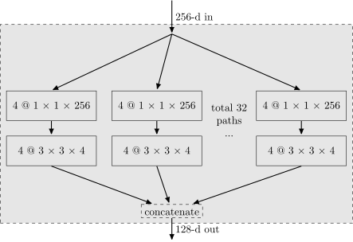
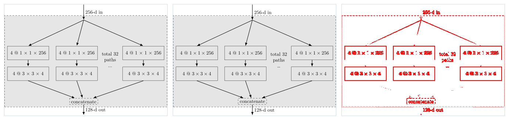
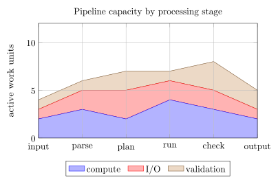
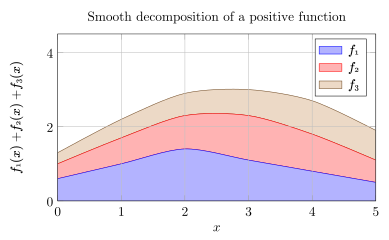
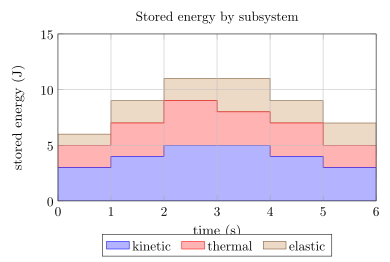

# Public Examples

This page contains curated artifacts that are committed to the repository and
can be linked from GitHub, npm, issues, and external documentation. The full
comparison gallery is generated locally and is intentionally not committed.

## Aggregation Blocks

[](images/examples/aggregation-blocks.svg)

This flow diagram exercises named nodes, reusable styles, math labels,
positioning, dashed paths, and `Latex` arrow tips.

- [Open the TikZKit SVG](images/examples/aggregation-blocks.svg)
- [Open the TikZ source](../test/fixtures/examples/latex-examples/aggregation-blocks.tex)
- [Open the visual comparison](images/examples/aggregation-blocks-comparison.png)

The comparison sheet places the `tikztosvg` reference, TikZKit rendering, and
pixel difference from left to right.

[](images/examples/aggregation-blocks-comparison.png)

## PGFPlots Stacked Areas

| Algorithm | Mathematics | Physics |
| --- | --- | --- |
| [](../test/fixtures/examples/pgfplots/stacked-area/algorithm.tex) | [](../test/fixtures/examples/pgfplots/stacked-area/math.tex) | [](../test/fixtures/examples/pgfplots/stacked-area/physics.tex) |

These examples exercise `stack plots=y`, `area style`, `\closedcycle`, legends,
grids, and sharp, smooth, or constant plot handlers.

## Local Comparison Gallery

Generate the complete local gallery from the repository root:

```bash
npm install
npm run web:output
npm run examples:diff
PORT=5174 npm run web
```

Open <http://127.0.0.1:5174/>. Generated SVG, PNG, MacTeX, `tikztosvg`, and
diff artifacts are written below `test/fixtures/examples/output/`. They are
local evidence, not public repository files. See the
[generated artifact policy](generated-artifacts.md) for the directory rules.
